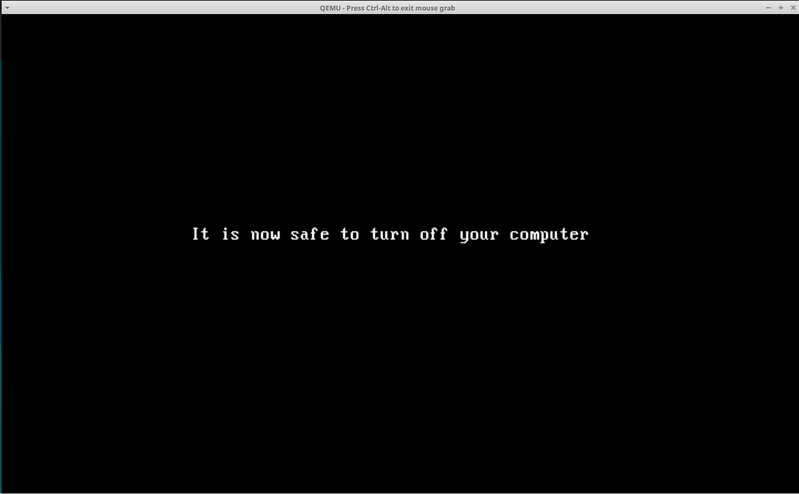

# Weenix OS - CS402 Operating Systems Project

Welcome to the landing page for the Weenix OS project, a comprehensive operating system implemented as part of the CS402 Operating Systems course at USC. Over the course of three assignments, a fairly complete OS with fully functioning Threads, Virtual File System (VFS), and Virtual Memory (VM) modules was developed.

## Table of Contents

- [Introduction](#introduction)
- [Project Structure](#project-structure)
- [Implemented Modules](#implemented-modules)
  - [Threads](#threads)
  - [Virtual File System (VFS)](#virtual-file-system-vfs)
  - [Virtual Memory (VM)](#virtual-memory-vm)
- [Screenshots](#screenshots)
- [Disclaimer](#disclaimer)

## Introduction

Weenix OS is a Unix-like operating system originally created by the teaching assistants at Brown University to provide students with a hands-on experience in OS development. Our project is a continuation and expansion of this work, tailored to the curriculum of USC's CS402 course.

## Project Structure

The project is divided into three main modules, each representing a critical aspect of operating system functionality:

1. **Threads** - Process and thread management, including synchronization primitives.
2. **Virtual File System (VFS)** - File system interface, providing a uniform interface to multiple file systems.
3. **Virtual Memory (VM)** - Memory management, including page fault handling and virtual memory mapping.

## Implemented Modules

### Threads

In the Threads module, we implemented:

- **Kernel Memory Management**: Efficient allocation and deallocation of memory within the kernel.
- **Boot Sequence**: Initial setup and configuration of the kernel during boot.
- **Process and Thread Creation**: Mechanisms to create, manage, and schedule processes and threads.
- **Synchronization Primitives**: Implementation of mutexes and condition variables for process synchronization.

### Virtual File System (VFS)

The VFS module covers:

- **VFS Layer Construction**: Development of the virtual file system layer to abstract file system operations.
- **Pathname to Vnode Conversion**: Resolving pathnames to vnodes for file operations.

### Virtual Memory (VM)

The VM module includes:

- **Virtual Memory Maps**: Mapping virtual addresses to physical memory.
- **Page Fault Handling**: Managing page faults and ensuring correct memory access.
- **Anonymous and Shadow Objects**: Memory management techniques for efficient memory allocation.
- **System Calls**: Implementing VM-related system calls, including the fork syscall.

## Screenshots

Screenshots taken from the Weenix Kernel are shown below:

    
    
    
    
    
    
    
    

## Disclaimer

This repository serves a landing page showcasing the work done during the Kernel Assignments in the CSCI 402 course. Source code is not publicly available following academic integrity guidelines, but a private demo can be provided upon request.

Please feel free to reach out and request a private demo to explore this project further.
